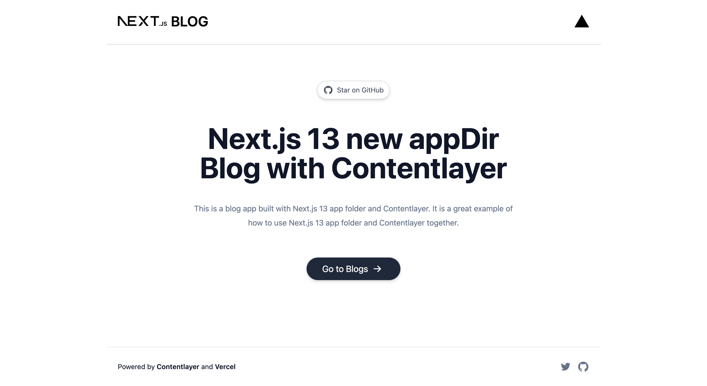

# Contentlayer + [Next.js 13 Blog](https://nextjs-appdir-blog.vercel.app)

Welcome to the Contentlayer + Next.js 13 Blog, a blog app built with Next.js 13 app folder and Contentlayer. It serves as an excellent example of how to use Next.js 13 app folder and Contentlayer together.

## How it works

This project utilizes the Contentlayer content manager and the experimental app of Next.js 13. The latest version of Next.js brings new features like appDir, metadata API, and more. Contentlayer simplifies content management and enhances the developer experience of modern web frameworks, especially in Next.js projects. With these powerful tools, you can create an incredible blog in a new and exciting way.

If you want to know more about how this project was built, please check out the corresponding [blog post](https://arshadd.site/writing/nextjs-appdir-blog).

And if you want to try it out for yourself, simply clone this example project.

## Running Locally

To run the application locally, open your terminal and execute the following command. After that, it will be available at `http://localhost:3000`.

## One-Click Deploy

Deploy the example using [Vercel](https://vercel.com?utm_source=github&utm_medium=readme&utm_campaign=vercel-examples) by clicking on the button below.

